# Generative Adversarial Networks: Face Synthesis

Implementation of a GAN for face synthesis using a celebrity image dataset.

## General Setup

### Set up Virtual Environment

Note: `Anaconda` can also be used for the venv

```shell
$ python -m venv venv
$ source venv/bin/activate
$ pip install -r requirements.txt
```

To start a new Jupyter Notebook kernel based on the current virtual environment:

```shell
$ python -m ipykernel install --user --name ENV_NAME --display-name "ENV_DISPLAY_NAME"
```

## Data

We use the [CelebA](http://mmlab.ie.cuhk.edu.hk/projects/CelebA.html) dataset to train our GAN. CelebA is a large-scale face attributes dataset with more than **200K** celebrity images.


## Preprocessing Data

We the following transformations on image data so all images are cropped to size `64x64x3` and normalized:

    torchvision.transforms.CenterCrop(160)
    torchvision.transforms.Resize(64)
    torchvision.transforms.ToTensor()
    torchvision.transforms.Normalize((0.5, 0.5, 0.5), (0.5, 0.5, 0.5))

## GAN Network

### Generator

Base model structure


### Discriminator

Base model structure


### Loss function

Binary Cross Entropy Loss for the minimax GAN loss

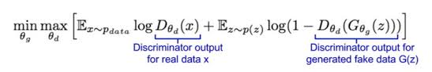

We use a `batch size` of `64`, latent vector z size of `100`

### Hyper Parameters used

```python
input image dimension = 64 x 64 x 3
latent vector z size  = 100
ADAM optimizer beta1  = 0.5
learning rate         = 0.0002
batch size            = 64
epochs                = 100
```

## Results

#### Epoch 0

The generated images have some semblance of a human face.

|              Real image set              |            Generated image set           |
| :--------------------------------------: | :--------------------------------------: |
| 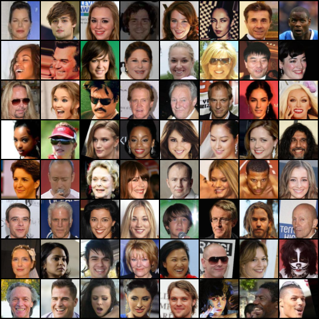 | 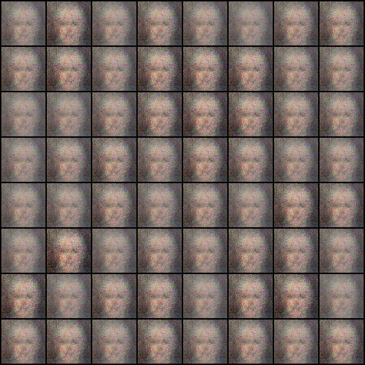 |

#### Epoch 1

The closeness to a human face is much more pronounced.

|              Real image set              |            Generated image set           |
| :--------------------------------------: | :--------------------------------------: |
| 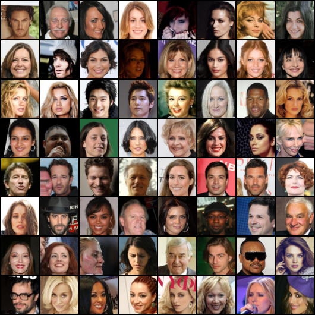 | 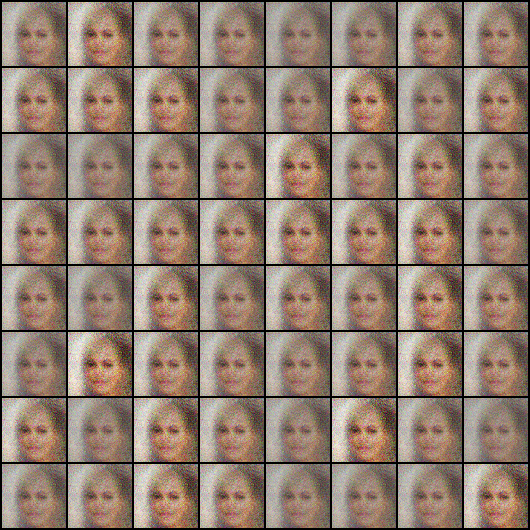 |

#### Epoch 2

The generated images have the prominent facial features of a human face.

|              Real image set              |            Generated image set           |
| :--------------------------------------: | :--------------------------------------: |
| 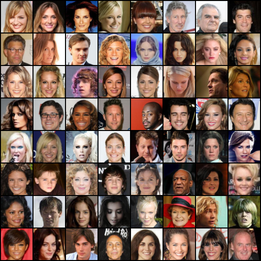 | 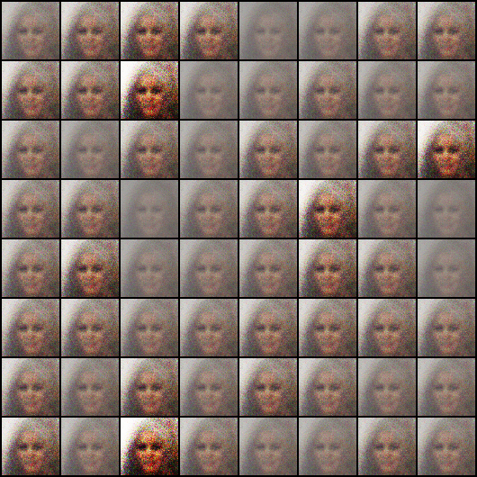 |

#### Epoch 3

The generated images have formed distinct although blurry faces.

|              Real image set              |            Generated image set           |
| :--------------------------------------: | :--------------------------------------: |
| 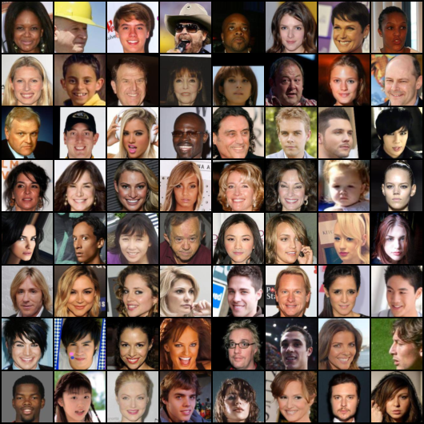 | 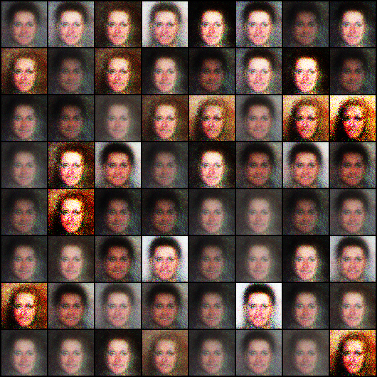 |

### Test run on a tiny dataset

We trained our GAN model on the mini_data which contains images enough for only a single batch of 64 images for 100 epochs:

As expected, the Loss curves were not promising for training with such a small dataset:

|      GAN loss mini_data run 1     |      GAN loss mini_data run 2     |
| :-------------------------------: | :-------------------------------: |
| 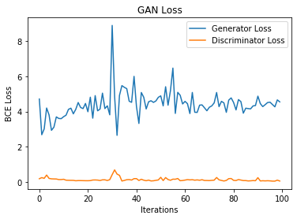 | 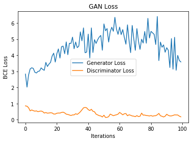 |

## Acknowledgements

-   Liu, Ziwei, Ping Luo, Xiaogang Wang, and Xiaoou Tang. “Deep Learning Face Attributes in the Wild.” ArXiv:1411.7766 [Cs], September 24, 2015. <http://arxiv.org/abs/1411.7766>.
